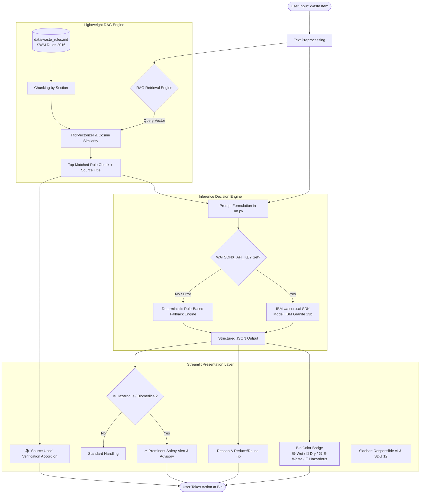

# EcoSort System Flow Diagram

This diagram visualizes the flow of data through the **EcoSort** AI Waste Segregation system, from user input to TF-IDF retrieval, prompt construction, IBM Granite processing, and final UI rendering.

